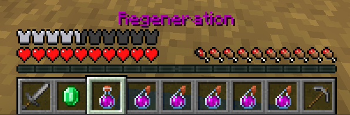
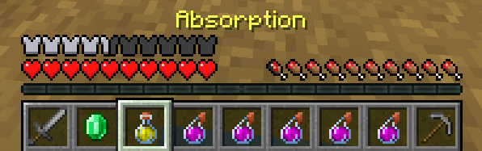
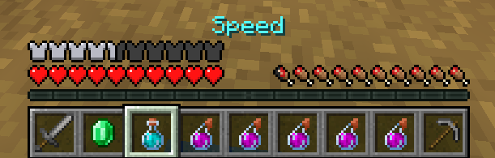
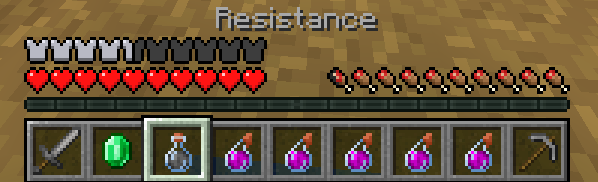

# Buff Master

***

#### 

# Overview
***
- **Introduced:** v1.7.0
- **Description:** A support kit that gives potion effects to teammates. Selectable buffs include Regeneration, Absorption, Speed, and Resistance.
- **Role:** Support
- **Cost:** 500 Credits

   

# Gear
***
- Iron Chestplate
- Leather Leggings
- Iron Boots
- Wooden Sword
- Buff
- Select Buff
- 7 Healing Potions

   

# Active Abilities
***
## Buff
Right click to buff all allies in a certain radius (including self). The buff applied will be determined by the currently selected buff. The cooldown will be increased the more allies are affected.

<!--  -->

## Select Buff
Right click to cycle between buffs forwards. Left click to cycle between buffs backwards. Available effects are Regeneration, Absorption, Speed, and Resistance.

  

# Achievements
***

| Achievement | Description | Reward |
| ----------- | ----------- | ------ |
| Family Practice | Buff 4 teammates with one activation. | 20 Credits |
| Stronk Creeper | Buff a creeper with buff master. | 20 Credits |
| The True Buff Master | Buff 1,000 teammates. | 100 Credits |

   

# Kit Data
***

| Property | Value | Description |
|----------|-------|-------------|
| | | |
| | | |
| | | |
| | | |
| | | |
