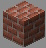

# Builder

***

#### 

# Overview
***
- **Introduced:** v1.7.0
- **Description:** A utility kit that can place bricks and ladders around the map.
- **Role:** Utility
- **How to Unlock:** Unlocked by Default.

   

# Gear
***
- Chainmail Chestplate
- Chainmail Leggings
- Chainmail Boots
- {{ kits.builder.data.BUILDER_BRICKS_COUNT }} Builder Bricks
- {{ kits.builder.data.BUILDER_LADDERS_COUNT }} Builder Ladders
- {{ kits.builder.data.MAX_HEALING_POTIONS }} Healing Potions

   

# Abilities
***
### Actives
<!-- tabs:start -->
#### **Bricks**
## Bricks
Place bricks in most places around the map.

#### **Brick Melee**
## Brick Melee
Use your bricks to melee and deal massive knockback. Damaging an enemy with your bricks will consume `{{ kits.builder.data.BUILDER_BRICKS_REMOVE_COUNT_ON_MELEE }}` bricks.

#### **Ladders**
## Ladders
Place ladders in most places around the map.

<!-- tabs:end -->

### Passives
<!-- tabs:start -->
#### **Builders Toolbox**
## Builders Toolbox
Regenerate 1 bricks every `{{ kits.builder.data.BUILDER_BRICKS_REGENERATION_TICK_INTERVAL }}` ticks and 1 ladder every `{{ kits.builder.data.BUILDER_LADDERS_REGENERATION_TICK_INTERVAL }}` ticks.

Receive bricks and ladders from engineer dispensers.

<!-- tabs:end -->
   

# Achievements
***

| Achievement | Description | Reward |
| ----------- | ----------- | ------ |
| BUILDAH KILL! | Eliminate an enemy with your bricks. | 20 Credits |
| Don't underestimate the BRICKS! | Get an environmental kill as builder. | 20 Credits |
| Monumental Mason | Get 1,000 brick kills. | 250 Credits |
| Ladder to heaven! | Place 25,000 ladders. | 1,000 Credits |
| Sturdy fortress! | Place 100,000 bricks. | 1,000 Credits |

   

# Kit Data
***

| Property | Value | Description |
|----------|-------|-------------|
| MAX_HEALING_POTIONS | `{{ kits.builder.data.MAX_HEALING_POTIONS }}` | {{ kitDataSharedDescriptions.MAX_HEALING_POTIONS }} |
| BUILDER_BRICKS_COUNT | `{{ kits.builder.data.BUILDER_BRICKS_COUNT }}` | The maximum number of bricks that the player can hold in a stack. |
| BUILDER_BRICKS_FINAL_BLOW_REWARD | `{{ kits.builder.data.BUILDER_BRICKS_FINAL_BLOW_REWARD }}` | The number of bricks awarded for a final blow. |
| BUILDER_BRICKS_ASSIST_REWARD | `{{ kits.builder.data.BUILDER_BRICKS_ASSIST_REWARD }}` | The number of bricks awarded or an assist. |
| BUILDER_BRICKS_REGENERATION_TICK_INTERVAL | `{{ kits.builder.data.BUILDER_BRICKS_REGENERATION_TICK_INTERVAL }}` | The interval, in ticks, at which the player receives bricks naturally. |
| BUILDER_BRICKS_KNOCKBACK | `{{ kits.builder.data.BUILDER_BRICKS_KNOCKBACK }}` | The knockback level of the bricks. |
| BUILDER_BRICKS_DAMAGE | `{{ kits.builder.data.BUILDER_BRICKS_DAMAGE }}` | The base melee damage of the bricks. |
| BUILDER_BRICKS_SPEED | `{{ kits.builder.data.BUILDER_BRICKS_SPEED }}` | The base melee speed of the bricks. |
| BUILDER_BRICKS_REMOVE_COUNT_ON_MELEE | `{{ kits.builder.data.BUILDER_BRICKS_REMOVE_COUNT_ON_MELEE }}` | The number of bricks to remove from the current stack after meleeing an enemy. |
| BUILDER_BRICKS_DISPENSER_NUM | `{{ kits.builder.data.BUILDER_BRICKS_DISPENSER_NUM }}` | The number of bricks dispensed to the player from an engineer dispenser. |
| BUILDER_LADDERS_COUNT | `{{ kits.builder.data.BUILDER_LADDERS_COUNT }}` | The maximum number of ladders that the player can hold in a stack. |
| BUILDER_LADDERS_REGENERATION_TICK_INTERVAL | `{{ kits.builder.data.BUILDER_LADDERS_REGENERATION_TICK_INTERVAL }}` | The interval, in ticks, at which the player receives ladders natrually. |
| BUILDER_LADDERS_FINAL_BLOW_REWARD | `{{ kits.builder.data.BUILDER_LADDERS_FINAL_BLOW_REWARD }}` | The number of ladders awarded for a final blow. |
| BUILDER_LADDERS_ASSIST_REWARD | `{{ kits.builder.data.BUILDER_LADDERS_ASSIST_REWARD }}` | The number of ladders awarded for an assist.|
| BUILDER_LADDERS_DISPENSER_NUM | `{{ kits.builder.data.BUILDER_LADDERS_DISPENSER_NUM }}` | The number of ladders dispensed to the player from an engineer dispenser. |
