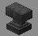

# Crusher

***

#### 

# Overview
***
- **Introduced:** v1.8.0
- **Description:** A damage kit that summons anvils to crush your enemies.
- **Role:** Damage
- **How to Unlock:** Purchase for 500 Credits

   

# Gear
***
- Chainmail Chestplate
- Chainmail Leggings
- Chainmail Boots
- Iron Sword
- Crusher
- {{ kits.crusher.data.MAX_HEALING_POTIONS }} Healing Potions

   

# Abilities
***
### Actives
<!-- tabs:start -->
#### **Crusher**
## Crusher
Right click to use. Upon using, the ability will target a block in the player's line of sight. If `CRUSHER_ANVIL_TARGET_ENEMIES` is set to `true`, then the crusher ability will prioritize targeting players. An anvil will spawn `{{ kits.crusher.data.CRUSHER_ANVIL_SUMMON_HEIGHT }}` meters above the target. The anvil deals damage when it lands. It deals more damage to targets closer to the point of impact. 

Falling anvils stun enemies for `{{ kits.crusher.data.CRUSHER_ANVIL_STUN_DURATION }}` ticks.

Anvils will damage engineer blocks.

<!-- tabs:end -->
   

# Achievements
***

| Achievement | Description | Reward |
| ----------- | ----------- | ------ |
| Bird Squ-”watcher” | Summon an anvil mid-air above a raven to bring them down and crush them. | 20 Credits |
| Bowling Ball vs Trampoline! | Kill a slime with an anvil. | 20 Credits |
| Heavy Metal | Get a direct anvil kill. | 20 Credits |
| Pixar Lamp | Crush an engineer sentry and destroy it. | 20 Credits |
| Anvil Inc. | Hit 1,000 enemies with summoned anvils. | 50 Credits |
| Splat! | Get a double anvil kill! | 50 Credits |
| Blacksmith's Graveyard | Get a triple anvil kill! | 50 Credits |
| “Kilogramme o' steel” | Get 1000 anvil kills! | 250 Credits |

   

# Kit Data
***

| Property | Value | Description |
|----------|-------|-------------|
| MAX_HEALING_POTIONS | `{{ kits.crusher.data.MAX_HEALING_POTIONS }}` | Maximum number of healing potions the player can carry. |
| CRUSHER_ANVIL_DIRECT_DAMAGE | `{{ kits.crusher.data.CRUSHER_ANVIL_DIRECT_DAMAGE }}` | The damage dealt by a direct anvil hit. |
| CRUSHER_ANVIL_INDIRECT_DAMAGE | `{{ kits.crusher.data.CRUSHER_ANVIL_INDIRECT_DAMAGE }}` | The damage dealt by an indirect anvil hit. |
| CRUSHER_ANVIL_SUMMON_HEIGHT | `{{ kits.crusher.data.CRUSHER_ANVIL_SUMMON_HEIGHT }}` | The distance above the target to determine the actual anvil summon location.  |
| CRUSHER_ANVIL_SUMMON_POINTS | `{{ kits.crusher.data.CRUSHER_ANVIL_SUMMON_POINTS }}` | The number of summon points to use to ray trace to a target. |
| CRUSHER_ANVIL_IMPACT_RADIUS | `{{ kits.crusher.data.CRUSHER_ANVIL_IMPACT_RADIUS }}` | The radius of an indirect anvil hit. |
| CRUSHER_ANVIL_DIRECT_IMPACT_RADIUS | `{{ kits.crusher.data.CRUSHER_ANVIL_DIRECT_IMPACT_RADIUS }}` | The radius of a direct anvil hit. |
| CRUSHER_ANVIL_STUN_RADIUS | `{{ kits.crusher.data.CRUSHER_ANVIL_STUN_RADIUS }}` | The radius around a falling anvil to stun targets. |
| CRUSHER_ANVIL_STUN_DURATION | `{{ kits.crusher.data.CRUSHER_ANVIL_STUN_DURATION }}` | The duration, in ticks, of the falling anvil stun. |
| CRUSHER_ANVIL_COOLDOWN | `{{ kits.crusher.data.CRUSHER_ANVIL_COOLDOWN }}` | The cooldown, in ticks, for the Crusher ability. |
| CRUSHER_ANVIL_SUMMON_ATTEMPTS | `{{ kits.crusher.data.CRUSHER_ANVIL_SUMMON_ATTEMPTS }}` | The number of attempts to summon an anvil. |
| CRUSHER_ANVIL_SUMMON_POINT_RADIUS | `{{ kits.crusher.data.CRUSHER_ANVIL_SUMMON_POINT_RADIUS }}` | The radius of a summon point used for ray tracing. |
| CRUSHER_ANVIL_SELF_DAMAGE_MULTIPLIER | `{{ kits.crusher.data.CRUSHER_ANVIL_SELF_DAMAGE_MULTIPLIER }}` | The self damage multiplier of an anvil when hitting the player. |
| CRUSHER_ANVIL_IGNORE_DAMAGE_TICKS | `{{ kits.crusher.data.CRUSHER_ANVIL_IGNORE_DAMAGE_TICKS }}` | Determines if the anvil should ignore invulnerability frames. |
| CRUSHER_ANVIL_TARGET_ENEMIES | `{{ kits.crusher.data.CRUSHER_ANVIL_TARGET_ENEMIES }}` | Determines if the Crusher ability should target enemies. |
| CRUSHER_SWORD_DAMAGE | `{{ kits.crusher.data.CRUSHER_SWORD_DAMAGE }}` | The base damage of the sword. |
| CRUSHER_SWORD_SPEED | `{{ kits.crusher.data.CRUSHER_SWORD_SPEED }}` | The base speed of the sword. |
