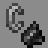

# Demolitionist

***

#### 

# Overview
***
- **Introduced:** v1.7.0
- **Description:** A tank kit that can use TNT to temporarily destroy player placed blocks.
- **Role:** Tank
- **How to Unlock:** Purchase for 500 Credits.

   

# Gear
***
- Netherite Chestplate
- Iron Leggings
- Iron Boots
- Stone Sword
- Shield
- Demolish
- {{ kits.demolitionist.data.MAX_HEALING_POTIONS }} Healing Potions

   

# Abilities
***
### Actives
<!-- tabs:start -->
#### **Demolition**
## Demolition
Right click a block to create a demolitionist bomb. When the bomb explodes will deal `{{ kits.demolitionist.data.DEMOLITIONIST_DEMOLISH_DAMAGE }}` damage and temporaily destroy all blocks placed by players for `{{ kits.demolitionist.data.DEMOLITIONIST_DEMOLISH_BLOCKS_BROKEN_DURATION }}` ticks in a `{{ kits.demolitionist.data.DEMOLITIONIST_DEMOLISH_RADIUS }}` block radius.

#### **Instant Demolition**
## Instant Demolition
Igniting an bomber bomb will cause it to detonate instantly and explode as a demolitionist bomb. A demolitionist bomb created this way will not destroy blocks.

#### **Forced Demolition**
## Forced Demolition
The player can ignite creepers.

<!-- tabs:end -->

### Passives
<!-- tabs:start -->
#### **Bomb Recycling**
## Bomb Recycling
When the player is close to a friendly [Bomber](./Bomber.md), and the friendly Bomber break their bombs, they will receive their bomber bombs back instantly.

<!-- tabs:end -->

# Achievements
***

| Achievement | Description | Reward |
| ----------- | ----------- | ------ |
| Bomb Recycler | Help a bomber recycle their bomb. | 20 Credits |
| Forced Ignition | Ignite a creeper with a potion effect applied on it. | 20 Credits |
| My bombs are bigger | Ignite an enemy bomb and get a kill. | 20 Credits |
| 2 with one Bomb | Get a double bomb kill as a demolitionist. | 50 Credits |
| Bombs, Blocks, and Bones | Get a triple bomb kill as a demolitionist. | 50 Credits |
| Where did they go? Are they in the walls? | Get a quadruple bomb kill as a demolitionist. | 50 Credits |
| Base Breaker | Destroy 100,000 blocks with your bomb. | 250 Credits |
| Ultimate Demolisher | Get 1000 bomb kills as a demolitionist. | 250 Credits |

   

# Kit Data
***

| Property | Value | Description |
|----------|-------|-------------|
| MAX_HEALING_POTIONS | `{{ kits.demolitionist.data.MAX_HEALING_POTIONS }}` | {{ kitDataSharedDescriptions.MAX_HEALING_POTIONS }} |
| DEMOLITIONIST_SWORD_DAMAGE | `{{ kits.demolitionist.data.DEMOLITIONIST_SWORD_DAMAGE }}` | The base damage of the sword. |
| DEMOLITIONIST_SWORD_SPEED | `{{ kits.demolitionist.data.DEMOLITIONIST_SWORD_SPEED }}` | The base speed of the sword. |
| DEMOLITIONIST_DEMOLISH_YIELD | `{{ kits.demolitionist.data.DEMOLITIONIST_DEMOLISH_YIELD }}` | The minecraft bomb yield value. (this isn't measured in meters/blocks) |
| DEMOLITIONIST_DEMOLISH_DAMAGE | `{{ kits.demolitionist.data.DEMOLITIONIST_DEMOLISH_DAMAGE }}` | The base damage of a Demolitionist Bomb. |
| DEMOLITIONIST_DEMOLISH_BOMB_FUSE_TICKS | `{{ kits.demolitionist.data.DEMOLITIONIST_DEMOLISH_BOMB_FUSE_TICKS }}` | The time, in ticks, it takes for a Demolitionist Bomb to explode. |
| DEMOLITIONIST_DEMOLISH_BLOCKS_BROKEN_DURATION | `{{ kits.demolitionist.data.DEMOLITIONIST_DEMOLISH_BLOCKS_BROKEN_DURATION }}` | The duration, in ticks, of broken blocks from the Demolition Ability before reappearing. |
| DEMOLITIONIST_DEMOLISH_COOLDOWN | `{{ kits.demolitionist.data.DEMOLITIONIST_DEMOLISH_COOLDOWN }}` | The cooldown, in ticks, of the Demolition Ability. |
| DEMOLITIONIST_DEMOLISH_RADIUS | `{{ kits.demolitionist.data.DEMOLITIONIST_DEMOLISH_RADIUS }}` | The radius of Demolitionist Bombs. |
| DEMOLITIONIST_DEMOLISH_SELF_DAMAGE_MULTIPLIER | `{{ kits.demolitionist.data.DEMOLITIONIST_DEMOLISH_SELF_DAMAGE_MULTIPLIER }}` | The damage multiplier of bomb damage from the player's own bombs. |
| DEMOLITIONIST_BOMB_RECYCLE_RADIUS | `{{ kits.demolitionist.data.DEMOLITIONIST_BOMB_RECYCLE_RADIUS }}` | The radius of the Bomb Recycling passive. |
| DEMOLITIONIST_FORCED_DEMOLITION_COOLDOWN | `{{ kits.demolitionist.data.DEMOLITIONIST_FORCED_DEMOLITION_COOLDOWN }}` | The cooldown, in ticks, of the Forced Demolition ability. |
| DEMOLITIONIST_INSTANT_DEMOLITION_COOLDOWN | `{{ kits.demolitionist.data.DEMOLITIONIST_INSTANT_DEMOLITION_COOLDOWN }}` | The cooldown, in ticks, of the instant demolition ability. |