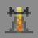
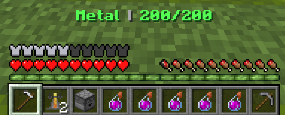

# Engineer

***

#### 

# Overview
***
- **Introduced:** v1.7.0
- **Description:** A utility kit that provides damage with sentries, mobility with teleporters, and consumables with dispensers.
- **Role:** Utility
- **How to Unlock:** Purchase for 500 Credits.

   

# Gear
***
- Chainmail Chestplate
- Chainmail Leggings
- Chainmail Boots
- Wrench
- {{ kits.engineer.data.ENGINEER_MAX_SENTRIES }} Sentries
- {{ kits.engineer.data.ENGINEER_MAX_DISPENSERS }} Dispenser
- 1 Teleporter Entrance
- 1 Teleporter Exit
- {{ kits.engineer.data.ENGINEER_SATCHEL_MAX_METAL }} Metal
- {{ kits.engineer.data.MAX_HEALING_POTIONS }} Healing Potions

   

# Abilities
***
### Resources
<!-- tabs:start -->
#### **Metal**
## Metal
Metal is a resource used to repair and place sentries, dispensers, and teleporters. The player can see how munch metal they have by holding their [Wrench](#wrench) or looking at their expeirence bar.

<!-- tabs:end -->
### Actives
<!-- tabs:start -->
#### **Wrench**
## Wrench

Players can use their Wrench to repair any friendly sentries, dispensers, entrance teleporters, and exit teleporters by `{{ kits.engineer.data.ENGINEER_WRENCH_REPAIR_AMOUNT }}` HP. This will cost `{{ kits.engineer.data.ENGINEER_WRENCH_REPAIR_METAL_AMOUNT }}` metal.

Player's can pick up their sentries, dispensers, entrance teleporters, and exit teleporters. The metal refunded is determined by the percentage of remaining of HP.

#### **Sentries**
## Sentries
Sentries are `Engineer Blocks` that will fire projectiles at enemies. Placing a sentry costs `{{ kits.engineer.data.ENGINEER_SENTRY_METAL_COST }}` metal and will take `{{ kits.engineer.data.ENGINEER_SENTRY_WARMUP }}` ticks to warmup. Players can cannot place sentries within `{{ kits.engineer.data.ENGINEER_SENTRY_LIMIT_RADIUS }}` meters of other friendly Sentires. Sentries will target `{{ kits.engineer.data.ENGINEER_SENTRY_TARGETS_PER_SHOT }}` enemy in a `{{ kits.engineer.data.ENGINEER_SENTRY_FIRE_RADIUS }}` meter radius and fire every `{{ kits.engineer.data.ENGINEER_SENTRY_FIRE_RATE }}` ticks. Sentries deal `{{ kits.engineer.data.ENGINEER_SENTRY_PROJECTILE_DAMAGE }}` damage.

Sentries can be damaged by enemies.

Sentries will not shoot if they are stunned.

Sentries will shoot at allies if they are hacked.

#### **Dispensers**
## Dispensers
Dispensers are `Engineer Blocks` that will give consumables to allies. Placing a dispenser costs `{{ kits.engineer.data.ENGINEER_DISPENSER_METAL_COST }}` metal. Players cannot place dispensers within `{{ kits.engineer.data.ENGINEER_DISPENSER_LIMIT_RADIUS }}` meters of friendly Dispensers. Dispensers will dispense potions and other consumables every `{{ kits.engineer.data.ENGINEER_DISPENSER_DISPENSE_RATE }}` ticks to all allies within a `{{ kits.engineer.data.ENGINEER_DISPENSER_DISPENSE_RADIUS }}` meter radius. In addition, when Dispensers dispense, they will refresh all ability cooldowns by `{{ kits.engineer.data.ENGINEER_DISPENSE_COOLDOWN_REFRESH_PERCENT }}%`.

Dispensers can be damaged by enemies.

Dispensers will not dispense if they are stunned.

Dispensers will dispense to enemies when they are hacked.

#### **Teleporters**
## Teleporters
Teleporters are `Engineer Blocks` that teleport players. Entrance and Exit teleporters must be placed within `{{ kits.engineer.data.ENGINEER_ENTRANCE_EXIT_MAX_DISTANCE }}` meters.

<!-- tabs:start -->
#### **Entrance Teleporter**
## Entrance Teleporter
Placing a entrance teleporter costs `{{ kits.engineer.data.ENGINEER_ENTRANCE_TELEPORTER_METAL_COST }}` metal. The players can use entrance teleporters by walking over them.

#### **Exit Teleporter**
## Exit Teleporter
Placing an exit teleporter costs `{{ kits.engineer.data.ENGINEER_EXIT_TELEPORTER_METAL_COST }}` metal. After a player uses the corresponding teleporter entrance, they will teleport to the exit teleporter.

<!-- tabs:end -->

Teleporters can be damaged by enemies.

Teleporters cannot be used if they are stunned.

Enemies can use teleporter entrances when they are hacked.

<!-- tabs:end -->

### Passives
<!-- tabs:start -->
#### **Metal Scrapper**
## Metal Scrapper
Obtain `{{ kits.engineer.data.ENGINEER_KILL_ELIMINATION_REWARD }}` metal after an elimination.

<!-- tabs:end -->
 

# Achievements
***

| Achievement | Description | Reward |
| ----------- | ----------- | ------ |
| Doc Holiday! | Have a dispenser dispense to three teammates at the same time. | 20 Credits |
| Howdy, pardner! | Stun an enemy sentry! | 20 Credits |
| Land Grab! | Help a teammate repair one of their buildings. | 20 Credits |
| The engineer is Engi-here! | As engineer, take your teleporter that leads right into the enemy base. | 20 Credits |
| Drugstore Cowboy | Dispense a combined amount of over 10,000 health pots. | 250 Credits |
| Best Little Slaughterhouse in Texas | Rack up over 5,000 kills with your sentry gun. | 1,000 Credits |

   

# Kit Data
***

| Property | Value | Description |
|----------|-------|-------------|
| MAX_HEALING_POTIONS | `{{ kits.engineer.data.MAX_HEALING_POTIONS }}` | {{ kitDataSharedDescriptions.MAX_HEALING_POTIONS }} |
| ENGINEER_WRENCH_DAMAGE | `{{ kits.engineer.data.ENGINEER_WRENCH_DAMAGE }}` | The base damage of the wrench. |
| ENGINEER_WRENCH_SPEED | `{{ kits.engineer.data.ENGINEER_WRENCH_SPEED }}` | The base speed of the wrench. |
| ENGINEER_WRENCH_REPAIR_AMOUNT | `{{ kits.engineer.data.ENGINEER_WRENCH_REPAIR_AMOUNT }}` | The amount of HP when repairing `Engineer Blocks` |
| ENGINEER_WRENCH_REPAIR_METAL_AMOUNT | `{{ kits.engineer.data.ENGINEER_WRENCH_REPAIR_METAL_AMOUNT }}` | The amount of metal used when repairing `Engineer Blocks` |
| ENGINEER_SENTRY_WARMUP | `{{ kits.engineer.data.ENGINEER_SENTRY_WARMUP }}` | The time, in ticks, it takes for a sentry to warm up before firing. |
| ENGINEER_SENTRY_FIRE_RATE | `{{ kits.engineer.data.ENGINEER_SENTRY_FIRE_RATE }}` | The fire rate, in ticks, of a sentry. |
| ENGINEER_SENTRY_FIRE_RADIUS | `{{ kits.engineer.data.ENGINEER_SENTRY_FIRE_RADIUS }}` | The target radius of a sentry. |
| ENGINEER_SENTRY_LIMIT_RADIUS | `{{ kits.engineer.data.ENGINEER_SENTRY_LIMIT_RADIUS }}` | Determines how many meters apart friendly sentries must be placed from one another. |
| ENGINEER_SENTRY_PROJECTILE_SPEED | `{{ kits.engineer.data.ENGINEER_SENTRY_PROJECTILE_SPEED }}` | The projectile speed of sentry projectiles. |
| ENGINEER_SENTRY_PROJECTILE_SIZE | `{{ kits.engineer.data.ENGINEER_SENTRY_PROJECTILE_SIZE }}` | The hitbox size of the sentry projectiles. |
| ENGINEER_SENTRY_PROJECTILE_PIERCE_LEVEL | `{{ kits.engineer.data.ENGINEER_SENTRY_PROJECTILE_PIERCE_LEVEL }}` | The amount of times a sentry projectile will pierce enemies. |
| ENGINEER_SENTRY_PROJECTILE_DAMAGE | `{{ kits.engineer.data.ENGINEER_SENTRY_PROJECTILE_DAMAGE }}` | The base damage of sentry projectiles. |
| ENGINEER_SENTRY_METAL_COST | `{{ kits.engineer.data.ENGINEER_SENTRY_METAL_COST }}` | The metal required to place a sentry. |
| ENGINEER_MAX_SENTRIES | `{{ kits.engineer.data.ENGINEER_MAX_SENTRIES }}` | The maximum number of sentries the player can have placed at once. |
| ENGINEER_SENTRY_HP | `{{ kits.engineer.data.ENGINEER_SENTRY_HP }}` | The HP of a sentry. |
| ENGINEER_SENTRY_TARGETS_PER_SHOT | `{{ kits.engineer.data.ENGINEER_SENTRY_TARGETS_PER_SHOT }}` | The number of targets a sentry can shoot at once. |
| ENGINEER_DISPENSER_DISPENSE_RATE | `{{ kits.engineer.data.ENGINEER_DISPENSER_DISPENSE_RATE }}` | The rate, in ticks, at which a dispenser dispenses. |
| ENGINEER_DISPENSER_DISPENSE_RADIUS | `{{ kits.engineer.data.ENGINEER_DISPENSER_DISPENSE_RADIUS }}` | The radius of a dispenser. |
| ENGINEER_DISPENSER_LIMIT_RADIUS | `{{ kits.engineer.data.ENGINEER_DISPENSER_LIMIT_RADIUS }}` | Determines how many meters apart friendly dispensers must be placed from one another. |
| ENGINEER_DISPENSER_METAL_COST | `{{ kits.engineer.data.ENGINEER_DISPENSER_METAL_COST }}` | The metal required to place a dispenser. |
| ENGINEER_MAX_DISPENSERS | `{{ kits.engineer.data.ENGINEER_MAX_DISPENSERS }}` | The maxiumum number of dispensers the player can have placed at once. |
| ENGINEER_DISPENSER_HP | `{{ kits.engineer.data.ENGINEER_DISPENSER_HP }}` | The HP of a dispenser. |
| ENGINEER_DISPENSER_DISPENSE_METAL | `{{ kits.engineer.data.ENGINEER_DISPENSER_DISPENSE_METAL }}` | The amount of metal the player will receive from a dispenser. |
| ENGINEER_DISPENSE_COOLDOWN_REFRESH_PERCENT | `{{ kits.engineer.data.ENGINEER_DISPENSE_COOLDOWN_REFRESH_PERCENT }}` | The percentage the dispenser will reduce cooldowns by. |
| ENGINEER_ENTRANCE_TELEPORTER_METAL_COST | `{{ kits.engineer.data.ENGINEER_ENTRANCE_TELEPORTER_METAL_COST }}` | The metal required to place an entrance teleporter. |
| ENGINEER_ENTRANCE_TELEPORTER_HP | `{{ kits.engineer.data.ENGINEER_ENTRANCE_TELEPORTER_HP }}` | The HP of a entrance teleporter. |
| ENGINEER_EXIT_TELEPORTER_METAL_COST | `{{ kits.engineer.data.ENGINEER_EXIT_TELEPORTER_METAL_COST }}` | The metal required to place an exit teleporter. |
| ENGINEER_EXIT_TELEPORTER_HP | `{{ kits.engineer.data.ENGINEER_EXIT_TELEPORTER_HP }}` | The HP of a exit teleporter. |
| ENGINEER_ENTRANCE_EXIT_MAX_DISTANCE | `{{ kits.engineer.data.ENGINEER_ENTRANCE_EXIT_MAX_DISTANCE }}` | The metal required to place an exit teleporter. |
| ENGINEER_SATCHEL_MAX_METAL | `{{ kits.engineer.data.ENGINEER_SATCHEL_MAX_METAL }}` | The maximum amount of metal the player can hold. |
| ENGINEER_KILL_ELIMINATION_REWARD | `{{ kits.engineer.data.ENGINEER_KILL_ELIMINATION_REWARD }}` | The amount of metal rewarded for an elimination. |