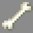
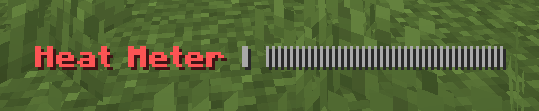

# Gunner

***

#### 

# Overview
***
- **Introduced:** v1.7.0
- **Description:** A damage kit that uses a machine gun to damage enemies.
- **Role:** Damage
- **How to Unlock:** Purchase for 500 Credits.

   

# Gear
***
- Chainmail Chestplate
- Chainmail Leggings
- Chainmail Boots
- Iron Sword
- Machine Gun
- {{ kits.gunner.data.MAX_HEALING_POTIONS }} Healing Potions

   

# Abilities
***

### Actives
<!-- tabs:start -->
#### **Machine Gun**
## Machine Gun
Right click to shoot bullets. Each time the player shoots, the heat meter percentage will increase. (The player must rev up before shooting)

If the hit enemy is blocking, they will still take damage, but will take `x{{ kits.gunner.data.GUNNER_BULLET_BLOCK_MULTIPLIER }}` damage.

#### **Rev Up**
## Rev Up
Left click to rev up.

#### **Rev Down**
## Rev Down
Left click to rev down.

The player will rev down automatcially if their machine gun overheats.

The player will rev down automatcially if they are stunned or hacked.

<!-- tabs:end -->

### Resources
<!-- tabs:start -->
#### **Heat Meter**
## Heat Meter
The heat meter indicates how close the machine gun is to overheating.

<!-- tabs:end -->
 

# Achievements
***

| Achievement | Description | Reward |
| ----------- | ----------- | ------ |
| Go ahead! Build your tiny gun, then run! | Destroy a sentry with your machine gun. | 20 Credits. |
| Not today, oh wait... | Get hit by a gunner bullet while shielding. | 20 Credits |
| Weeeeeeeeh! Waaaaaaaahh! | Gun down an enemy from 50 blocks away. | 50 Credits |
| Ooohhhh, run, run, I'm coming for you! | Get 1,000 machine gun kills. | 250 Credits |

   

# Kit Data
***

| Property | Value | Description |
|----------|-------|-------------|
| MAX_HEALING_POTIONS | `{{ kits.gunner.data.MAX_HEALING_POTIONS }}` | {{ kitDataSharedDescriptions.MAX_HEALING_POTIONS }} |
| GUNNER_SWORD_DAMAGE | `{{ kits.gunner.data.GUNNER_SWORD_DAMAGE }}` | The base damage of the sword. |
| GUNNER_SWORD_SPEED | `{{ kits.gunner.data.GUNNER_SWORD_SPEED }}` | The base speed of the sword. |
| GUNNER_BULLET_DAMAGE | `{{ kits.gunner.data.GUNNER_BULLET_DAMAGE }}` | The base damage of a bullet. |
| GUNNER_FIRE_RATE | `{{ kits.gunner.data.GUNNER_FIRE_RATE }}` | The fire rate, in ticks, of the machine gun. |
| GUNNER_OVERHEAT_COOLDOWN | `{{ kits.gunner.data.GUNNER_OVERHEAT_COOLDOWN }}` | The cooldown, in ticks, after the machine gun overheats. (Overheat cooling duration) |
| GUNNER_OVERHEAT_PERCENTAGE_PER_SHOT | `{{ kits.gunner.data.GUNNER_OVERHEAT_PERCENTAGE_PER_SHOT }}` | The heat percentage increase per bullet shot from the machine gun. |
| GUNNER_BULLET_VELOCITY_MULTIPLIER | `{{ kits.gunner.data.GUNNER_BULLET_VELOCITY_MULTIPLIER }}` | The multiplier that controls the initial speed of the bullet. |
| GUNNER_REV_UP_ICD | `{{ kits.gunner.data.GUNNER_REV_UP_ICD }}` | The cooldown, in ticks, to rev up and down. |
| GUNNER_COOLING_RATE | `{{ kits.gunner.data.GUNNER_COOLING_RATE }}` | The percentage per tick that the heat meter cools off by when revved down. |
| GUNNER_BULLET_BLOCK_MULTIPLIER | `{{ kits.gunner.data.GUNNER_BULLET_BLOCK_MULTIPLIER }}` | The damage multiplier of bullets when damaging enemies that are blocking. |