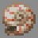

# Knight

***

#### 

# Overview
***
- **Introduced:** v1.7.0
- **Description:** A tank kit that uses their shield to mitigate damage for allies.
- **Role:** Tank
- **How to Unlock:** Purchase for 500 Credits.

   

# Gear
***
- Iron Chestplate
- Chainmail Leggings
- Iron Boots
- Stone Sword
- Shield
- Fortify
- {{ kits.knight.data.MAX_HEALING_POTIONS }} Healing Potions

   

# Abilities
***
### Actives
<!-- tabs:start -->
#### **Fortify**
## Fortify
When the ability is used, the player's shield becomes stronger. The shield will take `{{ kits.knight.data.KNIGHT_FORTIFY_SHIELD_DAMAGE_PERCENTAGE }}%` of the incoming damage and all damage types that would normally break or ignore the shield, will damage the shield instead. 

 

If `KNIGHT_FORTIFY_RESET_SHIELD_DURABILITY` is set to `true`, then the player's shield durability will reset upon activating this ability.

When the player's shield breaks, fortify will wear off.

<!-- tabs:end -->

### Passives
<!-- tabs:start -->
#### **Royal Guard**
## Royal Guard
While `Fortify` is active and the player is blocking, the player will take `{{ kits.knight.data.KNIGHT_ROYAL_GUARD_REDIRECTED_DAMAGE_PERCENTAGE }}%` of damage to nearby allies in a `{{ kits.knight.data.KNIGHT_FORTIFY_RADIUS }}` meter radius.

#### **Damage Deflection**
## Damage Deflection
While `Fortify` is active and the player is blocking, when enemies are within `{{ kits.knight.data.KNIGHT_FORTIFY_RADIUS }}` meters of the player and they damage the player's shield, `{{ kits.knight.data.KNIGHT_DAMAGE_DEFLECTION_PERCENTAGE }}%` of the incoming damage will be deflected at them.

<!-- tabs:end -->

 

# Achievements
***

| Achievement | Description | Reward |
| ----------- | ----------- | ------ |
| Royal Shield! | Absorb a decent amount of damage with the royal guard passive. | 20 Credits |
| Spiky! | Get a deflect kill. | 20 Credits |
| Thorns 1,000 | Get 1,000 deflect kills. | 250 Credits |
<!-- | Where do you think you're going? | Pull an enemy kangaroo while they are using their stomp ability. | 20 Credits -->

   

# Kit Data
***

| Property | Value | Description |
|----------|-------|-------------|
| MAX_HEALING_POTIONS | `{{ kits.knight.data.MAX_HEALING_POTIONS }}` | {{ kitDataSharedDescriptions.MAX_HEALING_POTIONS }} |
| KNIGHT_SWORD_DAMAGE | `{{ kits.knight.data.KNIGHT_SWORD_DAMAGE }}` | The base damage of the sword. |
| KNIGHT_SWORD_SPEED | `{{ kits.knight.data.KNIGHT_SWORD_SPEED }}` | The base speed of the sword. |
| KNIGHT_FORTIFY_SHIELD_DAMAGE_PERCENTAGE | `{{ kits.knight.data.KNIGHT_FORTIFY_SHIELD_DAMAGE_PERCENTAGE }}` | The percentage of shield damage that will be mitigated during the Fortify ability. |
| KNIGHT_ROYAL_GUARD_REDIRECTED_DAMAGE_PERCENTAGE | `{{ kits.knight.data.KNIGHT_ROYAL_GUARD_REDIRECTED_DAMAGE_PERCENTAGE }}` | The percentage of damage from allies that will be redirected to the player when the Royal Guard ability is trigged. |
| KNIGHT_DAMAGE_DEFLECTION_PERCENTAGE | `{{ kits.knight.data.KNIGHT_DAMAGE_DEFLECTION_PERCENTAGE }}` | The percentage of damage during Fortify that is deflected to enemies that attack the player's shield. |
| KNIGHT_FORTIFY_COOLDOWN | `{{ kits.knight.data.KNIGHT_FORTIFY_COOLDOWN }}` | The cooldown, in ticks, of the Fortify ability. |
| KNIGHT_FORTIFY_DURATION | `{{ kits.knight.data.KNIGHT_FORTIFY_DURATION }}` | The duration, in ticks, of the Fortify ability. |
| KNIGHT_FORTIFY_RADIUS | `{{ kits.knight.data.KNIGHT_FORTIFY_RADIUS }}` | The radius, in meters, of the Royal Guard and Damage Defelection abilies. |
| KNIGHT_FORTIFY_RESET_SHIELD_DURABILITY | `{{ kits.knight.data.KNIGHT_FORTIFY_RESET_SHIELD_DURABILITY }}` | Determines if the shield's durability should be reset when activing the Foritfy ability. |