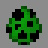

# Master

***

#### 

# Overview
***
- **Introduced:** v1.7.0
- **Description:** A damage kit that spawns creeper minions to fight along side the player.
- **Role:** Damage
- **How to Unlock:** Purchase for 500 credits.

   

# Gear
***
- Chainmail Chestplate
- Chainmail Leggings
- Chainmail Boots
- Iron Sword
- Creeper Minion Egg
- {{ kits.master.data.MAX_HEALING_POTIONS }} Healing Potions

   

# Abilities
***
### Actives
<!-- tabs:start -->
#### **Creeper Minion Egg**
## Creeper Minion Egg
Right click a block to spawn a creeper minion. Creepers minons can be spawned every `{{ kits.master.data.MASTER_MINIONS_SPAWN_CREEPER_COOLDOWN }}` ticks.

The player can have a maximum of `{{ kits.master.data.MASTER_MINIONS_MAX_CREEPERS }}` creeper minions alive once.

#### **Creeper Minion**
## Creeper Minion
Creepers have `{{ kits.master.data.MASTER_MINIONS_CREEPER_MAX_HEALTH }}` health and will deal `{{ kits.master.data.MASTER_MINIONS_CREEPER_DAMAGE }}` damage when they explode. The explosion radius is `{{ kits.master.data.MASTER_MINIONS_CREEPER_EXPLOSION_RADIUS}}` meters.

If the creeper is struck by lightning, it will turn into a super charged creeper minion. Super charged creeper minions deal `{{ kits.master.data.MASTER_MINIONS_CHARGED_CREEPER_DAMAGE }}` damage when they explode.

When creeper minons explode, they will explode builder bricks, jumper translocators, cobwebs.

When creeper minions explode, they will damage engineer blocks.

If a creeper has a potion effect and it explodes, the potion effects will linger. Positive effects will affect allies, and negative effects will affect enemies.

<!-- tabs:end -->
 

# Achievements
***

| Achievement | Description | Reward |
| ----------- | ----------- | ------ |
| Come on kiddies, have some ice cream. | Get a double creeper kill. | 20 Credits |
| Oh no, you dropped your ice cream. | Get a triple creeper kill. | 20 Credits |
| Head Dropper | Get a super creeper kill. | 20 Credits |
| Creeper Army! | Get 1,000 creeper kills. | 250 Credits |

   

# Kit Data
***

| Property | Value | Description |
|----------|-------|-------------|
| MAX_HEALING_POTIONS | `{{ kits.master.data.MAX_HEALING_POTIONS }}` | {{ kitDataSharedDescriptions.MAX_HEALING_POTIONS }} |
| MASTER_SWORD_DAMAGE | `{{ kits.master.data.MASTER_SWORD_DAMAGE }}` | The base damage of the sword. |
| MASTER_SWORD_SPEED | `{{ kits.master.data.MASTER_SWORD_SPEED }}` | The base speed of the sword. |
| MASTER_MINIONS_MAX_CREEPERS | `{{ kits.master.data.MASTER_MINIONS_MAX_CREEPERS }}` | The maximum number of creeper minions that can be alive at once. |
| MASTER_MINIONS_SPAWN_CREEPER_COOLDOWN | `{{ kits.master.data.MASTER_MINIONS_SPAWN_CREEPER_COOLDOWN }}` | The cooldown, in ticks, of the `Creeper Minion Egg` ability. |
| MASTER_MINIONS_CREEPER_DURATION | `{{ kits.master.data.MASTER_MINIONS_CREEPER_DURATION }}` | The life duration, in ticks, of creeper minions. |
| MASTER_MINIONS_CREEPER_DAMAGE | `{{ kits.master.data.MASTER_MINIONS_CREEPER_DAMAGE }}` | The explosion damage of creeper minions. |
| MASTER_MINIONS_CHARGED_CREEPER_DAMAGE | `{{ kits.master.data.MASTER_MINIONS_CHARGED_CREEPER_DAMAGE }}` | The explosion damage of super charged creeper minions. |
| MASTER_MINIONS_CREEPER_MAX_HEALTH | `{{ kits.master.data.MASTER_MINIONS_CREEPER_MAX_HEALTH }}` | The maximum health of creeper minions. |
| MASTER_MINIONS_CREEPER_EXPLOSION_RADIUS | `{{ kits.master.data.MASTER_MINIONS_CREEPER_EXPLOSION_RADIUS}}` | The explosion radius, in meters, of creeper minions. |