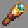

# Musketeer

***

#### 

# Overview
***
- **Introduced:** v1.7.0
- **Description:** A damage kit that uses a rifle and excels in ranged damage.
- **Role:** Damage
- **How to Unlock:** Purchase for 500 Credits.

   

# Gear
***
- Leather Chestplate (Yellow)
- Chainmail Leggings
- Leather Boots (Light Brown)
- Stone Sword
- Rifle
- {{ kits.musketeer.data.MUSKETEER_MAX_AMMO }} Reserve Ammo
- {{ kits.musketeer.data.MAX_HEALING_POTIONS }} Healing Potions

   

# Abilities
***
### Actives
<!-- tabs:start -->
#### **Rifle**
## Rifle
The rifle is the player's primary source of damage. There are two modes: "Sniper Mode" and "Burst Mode". "Sniper Mode" deals more damage from a far distance and "Burst Mode" deals more damage at close range. The player can sneak and left-click to switch between modes.

<!-- tabs:start -->
#### **Sniper Mode**
## Sniper Mode
Scope-in and unsneak to shoot. The rifle will consume `{{ kits.musketeer.data.MUSKETEER_RIFLE_SNIPER_MODE_AMMO_CONSUMPTION_PER_SHOT }}` ammo and shoot 1 bullet **without** travel time. The bullet will deal `{{ kits.musketeer.data.MUSKETEER_RIFLE_SNIPER_MODE_BULLET_DAMAGE }}` damage. The bullet's damage will begin to fall off at `{{ kits.musketeer.data.MUSKETEER_RIFLE_SNIPER_MODE_BULLET_FALLOFF_DISTANCE_START }}` meters. Sniper Mode bullets will also pierce enemies `{{ kits.musketeer.data.MUSKETEER_RIFLE_SNIPER_MODE_BULLET_PIERCING_LEVEL }}` times.

#### **Burst Mode**
## Burst Mode
Press right-click to shoot or scope-in and unsneak to shoot. The rifle will fire `{{ kits.musketeer.data.MUSKETEER_RIFLE_BURST_MODE_NUMBER_OF_SHOTS }}` times and each time it will consume `{{ kits.musketeer.data.MUSKETEER_RIFLE_BURST_MODE_AMMO_CONSUMPTION_PER_SHOT }}` ammo and shoot 1 bullet **with** travel time. Each bullet will deal `{{ kits.musketeer.data.MUSKETEER_RIFLE_BURST_MODE_BULLET_DAMAGE }}` damage. Each bullet's damage will begin to fall off at `{{ kits.musketeer.data.MUSKETEER_RIFLE_BURST_MODE_BULLET_FALLOFF_DISTANCE_START }}` meters. Burst Mode bullets ignore no damage ticks.

#### **Reloading**
## Reloading
The player can reload the rifle manually by left-clicking the rifle. Reloading will reload the rifle using reserve ammo. The player can also cancel reloading if the rifle magazine is **not** empty.

After the player shoots, if there is no ammo left in rifle's magazine, the rifle will auto-reload.

<!-- tabs:end -->

<!-- tabs:end -->

### Resources
<!-- tabs:start -->
#### **Ammo**
## Ammo
Ammo is a resource that is used by the [Rifle](#rifle) ability to fire bullets. The maximum  reserve ammo is `{{ kits.musketeer.data.MUSKETEER_MAX_AMMO }}`.

Players will receive `{{ kits.musketeer.data.MUSKETEER_AMMO_FINAL_BLOW_REWARD }}` ammo after earning a final blow and `{{ kits.musketeer.data.MUSKETEER_AMMO_ASSIST_REWARD }}` ammo after earning an assist.

Ally engineer dispensers will dispense `{{ kits.musketeer.data.MUSKETEER_AMMO_DISPENSER_DISPENSE_AMOUNT }}` ammo if the player is in range.

<!-- tabs:end -->
 

# Achievements
***

| Achievement | Description | Reward |
| ----------- | ----------- | ------ |
| ahh mustard... | Eliminate an enemy musketeer from a far distance as they eliminate you. | 20 Credits. |
| Jumper Stumper | Eliminate an enemy that is in midair with your rifle | 20 Credits |
| A shield's not gonna stop me! | Shoot an enemy through their shield to eliminate them. | 20 Credits |
| Sentry Sniper | Destroy a sentry from over 75 blocks away. | 20 Credits |
| Gun needs a break, eh? | Kill an enemy musketeer while they are reloading. | 20 Credits |
| American Revolution | Get 1,000 rifle kills. | 250 Credits |

   

# Kit Data
***

| Property | Value | Description |
|----------|-------|-------------|
| MAX_HEALING_POTIONS | `{{ kits.musketeer.data.MAX_HEALING_POTIONS }}` | {{ kitDataSharedDescriptions.MAX_HEALING_POTIONS }} |
| MUSKETEER_SWORD_DAMAGE | `{{ kits.musketeer.data.MUSKETEER_SWORD_DAMAGE }}` | The base damage of the sword. |
| MUSKETEER_SWORD_SPEED | `{{ kits.musketeer.data.MUSKETEER_SWORD_SPEED }}` | The base speed of the sword. |
| MUSKETEER_MAX_AMMO | `{{ kits.musketeer.data.MUSKETEER_MAX_AMMO }}` | The maximum number of reserve ammo the player can hold. |
| MUSKETEER_RIFLE_MAGAZINE_SIZE | `{{ kits.musketeer.data.MUSKETEER_RIFLE_MAGAZINE_SIZE }}` | The number of bullets that the rifle can hold in its magazine. |
| MUSKETEER_AMMO_DISPENSER_DISPENSE_AMOUNT | `{{ kits.musketeer.data.MUSKETEER_AMMO_DISPENSER_DISPENSE_AMOUNT }}` | The amount of ammo that is dispensed from a dispenser to the player. |
| MUSKETEER_AMMO_FINAL_BLOW_REWARD | `{{ kits.musketeer.data.MUSKETEER_AMMO_FINAL_BLOW_REWARD }}` | The amount of ammo that the player receives after earning a final blow. |
| MUSKETEER_AMMO_ASSIST_REWARD | `{{ kits.musketeer.data.MUSKETEER_AMMO_ASSIST_REWARD }}` | The amount of ammo that the player receives after earning an assist. |
| MUSKETEER_RIFLE_LEFT_CLICK_ACTION_ICD | `{{ kits.musketeer.data.MUSKETEER_RIFLE_LEFT_CLICK_ACTION_ICD }}` | The internal cooldown, in ticks, when left-clicking the rifle. |
| MUSKETEER_RIFLE_SNIPER_MODE_SHOOT_COOLDOWN | `{{ kits.musketeer.data.MUSKETEER_RIFLE_SNIPER_MODE_SHOOT_COOLDOWN }}` | The cooldown, in ticks, after firing the rifle in sniper mode. |
| MUSKETEER_RIFLE_SNIPER_MODE_RELOAD_DURATION | `{{ kits.musketeer.data.MUSKETEER_RIFLE_SNIPER_MODE_RELOAD_DURATION }}` | The duration, in ticks, when reloading in sniper mode. |
| MUSKETEER_RIFLE_SNIPER_MODE_BULLET_FALLOFF_DISTANCE_START | `{{ kits.musketeer.data.MUSKETEER_RIFLE_SNIPER_MODE_BULLET_FALLOFF_DISTANCE_START }}` | The distance, in meters, that a bullet's damage begins to fall off in sniper mode. |
| MUSKETEER_RIFLE_SNIPER_MODE_BULLET_FALLOFF_DISTANCE_END | `{{ kits.musketeer.data.MUSKETEER_RIFLE_SNIPER_MODE_BULLET_FALLOFF_DISTANCE_END }}` | The distance, in meters, that a bullet needs to travel in order for its damage to completely fall off to 1 damage in sniper mode. |
| MUSKETEER_RIFLE_SNIPER_MODE_BULLET_DAMAGE | `{{ kits.musketeer.data.MUSKETEER_RIFLE_SNIPER_MODE_BULLET_DAMAGE }}` | The base damage of sniper bullets. |
| MUSKETEER_RIFLE_SNIPER_MODE_BULLET_SPEED | `{{ kits.musketeer.data.MUSKETEER_RIFLE_SNIPER_MODE_BULLET_SPEED }}` | The speed of sniper bullets. (0 = no travel time) | 
| MUSKETEER_RIFLE_SNIPER_MODE_BULLET_SIZE | `{{ kits.musketeer.data.MUSKETEER_RIFLE_SNIPER_MODE_BULLET_SIZE }}` | The size of sniper bullets. |
| MUSKETEER_RIFLE_SNIPER_MODE_BULLET_PIERCING_LEVEL | `{{ kits.musketeer.data.MUSKETEER_RIFLE_SNIPER_MODE_BULLET_PIERCING_LEVEL }}` | The number of enemies that sniper bullets will pierce. |
| MUSKETEER_RIFLE_SNIPER_MODE_BULLET_BLOCK_MULTIPLIER | `{{ kits.musketeer.data.MUSKETEER_RIFLE_SNIPER_MODE_BULLET_BLOCK_MULTIPLIER }}` | The damage multiplier of sniper bullets that hit enemies that are blocking. |
| MUSKETEER_RIFLE_SNIPER_MODE_AMMO_CONSUMPTION_PER_SHOT | `{{ kits.musketeer.data.MUSKETEER_RIFLE_SNIPER_MODE_AMMO_CONSUMPTION_PER_SHOT }}` | The amount of ammo to consume when firing a sniper bullet. |
| MUSKETEER_RIFLE_SNIPER_MODE_BULLET_IGNORE_I_FRAMES | `{{ kits.musketeer.data.MUSKETEER_RIFLE_SNIPER_MODE_BULLET_IGNORE_I_FRAMES }}` | If sniper bullets should ignore no damage ticks. |
| MUSKETEER_RIFLE_BURST_MODE_SHOOT_COOLDOWN | `{{ kits.musketeer.data.MUSKETEER_RIFLE_BURST_MODE_SHOOT_COOLDOWN }}` | The cooldown, in ticks, after firing the rifle in burst mode. |
| MUSKETEER_RIFLE_BURST_MODE_RELOAD_DURATION | `{{ kits.musketeer.data.MUSKETEER_RIFLE_BURST_MODE_RELOAD_DURATION }}` | The duration, in ticks, when reloading in burst mode. |
| MUSKETEER_RIFLE_BURST_MODE_BULLET_FALLOFF_DISTANCE_START | `{{ kits.musketeer.data.MUSKETEER_RIFLE_BURST_MODE_BULLET_FALLOFF_DISTANCE_START }}` | The distance, in meters, that a bullet's damage begins to fall off in burst mode. |
| MUSKETEER_RIFLE_BURST_MODE_BULLET_FALLOFF_DISTANCE_END | `{{ kits.musketeer.data.MUSKETEER_RIFLE_BURST_MODE_BULLET_FALLOFF_DISTANCE_END }}` | The distance, in meters, that a bullet needs to travel in order for its damage to completely fall off to 1 damage in burst mode. |
| MUSKETEER_RIFLE_BURST_MODE_BULLET_DAMAGE | `{{ kits.musketeer.data.MUSKETEER_RIFLE_BURST_MODE_BULLET_DAMAGE }}` | The base damage of burst bullets. |
| MUSKETEER_RIFLE_BURST_MODE_BULLET_SPEED | `{{ kits.musketeer.data.MUSKETEER_RIFLE_BURST_MODE_BULLET_SPEED }}` | The speed of burst bullets. (0 = no travel time) |
| MUSKETEER_RIFLE_BURST_MODE_BULLET_SIZE | `{{ kits.musketeer.data.MUSKETEER_RIFLE_BURST_MODE_BULLET_SIZE }}` | The size of burst bullets. |
| MUSKETEER_RIFLE_BURST_MODE_BULLET_PIERCING_LEVEL | `{{ kits.musketeer.data.MUSKETEER_RIFLE_BURST_MODE_BULLET_PIERCING_LEVEL }}` | The number of enemies that burst bullets will pierce. |
| MUSKETEER_RIFLE_BURST_MODE_BULLET_BLOCK_MULTIPLIER | `{{ kits.musketeer.data.MUSKETEER_RIFLE_BURST_MODE_BULLET_BLOCK_MULTIPLIER }}` | The damage multiplier of burst bullets that hit enemies that are blocking. |
| MUSKETEER_RIFLE_BURST_MODE_AMMO_CONSUMPTION_PER_SHOT | `{{ kits.musketeer.data.MUSKETEER_RIFLE_BURST_MODE_AMMO_CONSUMPTION_PER_SHOT }}` | The amount of ammo to consume when firing a burst bullet. |
| MUSKETEER_RIFLE_BURST_MODE_BULLET_IGNORE_I_FRAMES | `{{ kits.musketeer.data.MUSKETEER_RIFLE_BURST_MODE_BULLET_IGNORE_I_FRAMES }}` | If burst bullets should ignore no damage ticks. |
| MUSKETEER_RIFLE_BURST_MODE_DELAY_BETWEEN_SHOTS | `{{ kits.musketeer.data.MUSKETEER_RIFLE_BURST_MODE_DELAY_BETWEEN_SHOTS }}` | The delay, in ticks, between burst shots. |
| MUSKETEER_RIFLE_BURST_MODE_NUMBER_OF_SHOTS | `{{ kits.musketeer.data.MUSKETEER_RIFLE_BURST_MODE_NUMBER_OF_SHOTS }}` | The number of bullets in a burst shot. |
| MUSKETEER_RIFLE_DO_GLOWING_ON_BULLET_HIT | `{{ kits.musketeer.data.MUSKETEER_RIFLE_DO_GLOWING_ON_BULLET_HIT }}` | If the bullets should affect enemies with glowing. |
| MUSKETEER_RIFLE_BULLET_GLOWING_DURATION | `{{ kits.musketeer.data.MUSKETEER_RIFLE_BULLET_GLOWING_DURATION }}` | The duration, in ticks, of the glowing effect. |