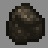

# Necromancer

***

#### 

# Overview
***
- **Introduced:** v1.7.0
- **Description:** A tank kit that summons a wither skeleton to fight for the player.
- **Role:** Tank
- **How to Unlock:** Purchase for 500 Credits.

   

# Gear
***
- Stone 
- Chainmail Chestplate
- Leather Leggings (Black)
- Chainmail Boots
- Stone Sword
- Shield
- Wither Skeleton Minion
- {{ kits.necromancer.data.MAX_HEALING_POTIONS }} Healing Potions

   

# Abilities
***
### Actives
<!-- tabs:start -->
#### **Wither Skeleton Minion**
## Wither Skeleton Minion
Summons a wither skeleton minion to fight for the player. The player can summon the skeleton by right-clicking a block and will cost `{{ kits.necromancer.data.NECROMANCER_WITHER_SKELETON_ESSENCE_PER_SKELETON }}` essence of the afterlife. The wither skeleton will target and attack enemies.

When the wither skeleton dies, the player will receive a cooldown that lasts `{{ kits.necromancer.data.NECROMANCER_WITHER_SKELETON_DEATH_COOLDOWN }}` ticks.

<!-- tabs:start -->

#### **Upgrade Skeleton**
## Upgrade Skeleton

Right-click the wither skeleton minion when it is at `100%` health to upgrade it. There are `5` levels and the wither skeleton starts at level `1`. This will cost `{{ kits.necromancer.data.NECROMANCER_WITHER_SKELETON_ESSENCE_UPGRADE_COST }}` essence of the afterlife.

#### **Heal Skeleton**
## Heal Skeleton

Right-click the wither skeleton minion to heal it for `{{ kits.necromancer.data.NECROMANCER_WITHER_SKELETON_HEAL_SKELETON_POTENCY }}` health. This will cost `{{ kits.necromancer.data.NECROMANCER_WITHER_SKELETON_ESSENCE_HEAL_COST }}` essence of the afterlife.

#### **Pick up Skeleton**
## Pick up Skeleton

Sneak and right-click the wither skeleton minion to pick it up. The player can only pick up their minion when it is **not** in combat. Picking up the skeleton will remember its current level and health.

The player's ability item and shield will become visually enchanted when the player is holding their skeleton. Deploying the wither skeleton again will cost `0` essence of the afterlife.

<!-- tabs:end -->

Skeletons have **5** levels. The higher the level, the stronger the skeleton.

<!-- tabs:start -->

#### **Level 1**
## Level 1

The wither skeleton minion is equipped with a stone sword that deals `{{ kits.necromancer.data.NECROMANCER_WITHER_SKELETON_STONE_SWORD_DAMAGE }}` damage and applies the wither effect for `{{ kits.necromancer.data.NECROMANCER_SWORD_WITHER_EFFECT_DURATION }}` ticks. It is also equipped with a shield. The skeleton has `{{ kits.necromancer.data.NECROMANCER_WITHER_SKELETON_LEVEL_1_BASE_HEALTH }}` health, `{{ kits.necromancer.data.NECROMANCER_WITHER_SKELETON_LEVEL_1_BASE_DEFENSE_POINTS }}` defense points and a permanent `+{{ kits.necromancer.data.NECROMANCER_WITHER_SKELETON_LEVEL_1_SPEED_INCREASE_PERCENTAGE }}%` speed boost.

#### **Level 2**
## Level 2

The wither skeleton minion gains armor that provides more defense.
- Chainmail chestplate: `{{ kits.necromancer.data.NECROMANCER_WITHER_SKELETON_LEVEL_2_CHESTPLATE_DEFENSE_POINTS }}` defense points.
- Leather leggings (Black): `{{ kits.necromancer.data.NECROMANCER_WITHER_SKELETON_LEVEL_2_LEGGINGS_DEFENSE_POINTS }}` defense points.
- Chainmail boots: `{{ kits.necromancer.data.NECROMANCER_WITHER_SKELETON_LEVEL_2_BOOTS_DEFENSE_POINTS }}` defense points.

#### **Level 3**
## Level 3

The wither skeleton minion gains an **additional** `{{ kits.necromancer.data.NECROMANCER_WITHER_SKELETON_LEVEL_3_HEALTH_INCREASE }}` health. The leather leggings also change color (Gray).

#### **Level 4**
## Level 4

The wither skeleton minion gains **stronger** armor that provides more defense.
- Iron chestplate: `{{ kits.necromancer.data.NECROMANCER_WITHER_SKELETON_LEVEL_4_CHESTPLATE_DEFENSE_POINTS }}` defense points.
- Leather leggings (Light Gray): `{{ kits.necromancer.data.NECROMANCER_WITHER_SKELETON_LEVEL_4_LEGGINGS_DEFENSE_POINTS }}` defense points.
- Iron boots: `{{ kits.necromancer.data.NECROMANCER_WITHER_SKELETON_LEVEL_4_BOOTS_DEFENSE_POINTS }}` defense points.

#### **Level 5**
## Level 5

The wither skeleton minion gains `+{{ kits.necromancer.data.NECROMANCER_WITHER_SKELETON_LEVEL_5_KNOCK_BACK_RESISTANCE_PERCENTAGE }}%` knockback resistance. The leather leggings also change color (White).

<!-- tabs:end -->

#### **Necromancer Sword**
## Necromancer Sword
A stone sword that applies the wither effect when hitting enemies. The wither effect lasts `{{ kits.necromancer.data.NECROMANCER_SWORD_WITHER_EFFECT_DURATION }}` ticks.

<!-- tabs:end -->

### Resources
<!-- tabs:start -->
#### **Essence of the Aftelife**
## Essence of the Aftelife
The resource to summon, heal, and upgrade wither skeletons. The player can hold a maximum of `{{ kits.necromancer.data.NECROMANCER_ESSENCE_OF_THE_AFTER_LIFE_MAX }}` essence. 

Essence of the Afterlife will drop from any player or minion that dies.

When the player dies, they will drop `{{ kits.necromancer.data.NECROMANCER_ESSENCE_OF_THE_AFTER_LIFE_PLAYER_DROP_COUNT_PERCENTAGE }}%` of their current essence.

<!-- tabs:end -->
 

# Achievements
***

| Achievement | Description | Reward |
| ----------- | ----------- | ------ |
| Wither Roses are black, Creepers are green | Have your wither skeleton minion kill an enemy creeper. | 20 Credits |
| Dead Man Tell No Tales | Get 1,000 skeleton kills. | 250 Credits |
| Undead Alchemy | Gather a total of 50,000 Essence of the Afterlife. | 250 Credits |

   

# Kit Data
***

| Property | Value | Description |
|----------|-------|-------------|
| MAX_HEALING_POTIONS | `{{ kits.necromancer.data.MAX_HEALING_POTIONS }}` | {{ kitDataSharedDescriptions.MAX_HEALING_POTIONS }} |
| NECROMANCER_SWORD_DAMAGE | `{{ kits.necromancer.data.NECROMANCER_SWORD_DAMAGE }}` | |
| NECROMANCER_SWORD_SPEED | `{{ kits.necromancer.data.NECROMANCER_SWORD_SPEED }}` | |
| NECROMANCER_SWORD_WITHER_EFFECT_LEVEL | `{{ kits.necromancer.data.NECROMANCER_SWORD_WITHER_EFFECT_LEVEL }}` | |
| NECROMANCER_SWORD_WITHER_EFFECT_DURATION | `{{ kits.necromancer.data.NECROMANCER_SWORD_WITHER_EFFECT_DURATION }}` | |
| NECROMANCER_ESSENCE_OF_THE_AFTER_LIFE_MAX | `{{ kits.necromancer.data.NECROMANCER_ESSENCE_OF_THE_AFTER_LIFE_MAX }}` | |
| NECROMANCER_ESSENCE_OF_THE_AFTER_LIFE_FINAL_BLOW_DROP | `{{ kits.necromancer.data.NECROMANCER_ESSENCE_OF_THE_AFTER_LIFE_FINAL_BLOW_DROP }}` | |
| NECROMANCER_ESSENCE_OF_THE_AFTER_LIFE_PLAYER_DROP_COUNT_PERCENTAGE | `{{ kits.necromancer.data.NECROMANCER_ESSENCE_OF_THE_AFTER_LIFE_PLAYER_DROP_COUNT_PERCENTAGE }}` | |
| NECROMANCER_WITHER_SKELETON_ESSENCE_PER_SKELETON | `{{ kits.necromancer.data.NECROMANCER_WITHER_SKELETON_ESSENCE_PER_SKELETON }}` | |
| NECROMANCER_WITHER_SKELETON_DURATION | `{{ kits.necromancer.data.NECROMANCER_WITHER_SKELETON_DURATION }}` | |
| NECROMANCER_WITHER_SKELETON_STONE_SWORD_DAMAGE | `{{ kits.necromancer.data.NECROMANCER_WITHER_SKELETON_STONE_SWORD_DAMAGE }}` | |
| NECROMANCER_WITHER_SKELETON_LEVEL_1_BASE_HEALTH | `{{ kits.necromancer.data.NECROMANCER_WITHER_SKELETON_LEVEL_1_BASE_HEALTH }}` | |
| NECROMANCER_WITHER_SKELETON_LEVEL_1_BASE_DEFENSE_POINTS | `{{ kits.necromancer.data.NECROMANCER_WITHER_SKELETON_LEVEL_1_BASE_DEFENSE_POINTS }}` | |
| NECROMANCER_WITHER_SKELETON_LEVEL_1_SPEED_INCREASE_PERCENTAGE | `{{ kits.necromancer.data.NECROMANCER_WITHER_SKELETON_LEVEL_1_SPEED_INCREASE_PERCENTAGE }}` | |
| NECROMANCER_WITHER_SKELETON_LEVEL_2_CHESTPLATE_DEFENSE_POINTS | `{{ kits.necromancer.data.NECROMANCER_WITHER_SKELETON_LEVEL_2_CHESTPLATE_DEFENSE_POINTS }}` | |
| NECROMANCER_WITHER_SKELETON_LEVEL_2_LEGGINGS_DEFENSE_POINTS | `{{ kits.necromancer.data.NECROMANCER_WITHER_SKELETON_LEVEL_2_LEGGINGS_DEFENSE_POINTS }}` | |
| NECROMANCER_WITHER_SKELETON_LEVEL_2_BOOTS_DEFENSE_POINTS | `{{ kits.necromancer.data.NECROMANCER_WITHER_SKELETON_LEVEL_2_BOOTS_DEFENSE_POINTS }}` | |
| NECROMANCER_WITHER_SKELETON_LEVEL_3_HEALTH_INCREASE | `{{ kits.necromancer.data.NECROMANCER_WITHER_SKELETON_LEVEL_3_HEALTH_INCREASE }}` | |
| NECROMANCER_WITHER_SKELETON_LEVEL_4_CHESTPLATE_DEFENSE_POINTS | `{{ kits.necromancer.data.NECROMANCER_WITHER_SKELETON_LEVEL_4_CHESTPLATE_DEFENSE_POINTS }}` | |
| NECROMANCER_WITHER_SKELETON_LEVEL_4_LEGGINGS_DEFENSE_POINTS | `{{ kits.necromancer.data.NECROMANCER_WITHER_SKELETON_LEVEL_4_LEGGINGS_DEFENSE_POINTS }}` | |
| NECROMANCER_WITHER_SKELETON_LEVEL_4_BOOTS_DEFENSE_POINTS | `{{ kits.necromancer.data.NECROMANCER_WITHER_SKELETON_LEVEL_4_BOOTS_DEFENSE_POINTS }}` | |
| NECROMANCER_WITHER_SKELETON_LEVEL_5_KNOCK_BACK_RESISTANCE_PERCENTAGE | `{{ kits.necromancer.data.NECROMANCER_WITHER_SKELETON_LEVEL_5_KNOCK_BACK_RESISTANCE_PERCENTAGE }}` | |
| NECROMANCER_WITHER_SKELETON_ESSENCE_DROP_COUNT | `{{ kits.necromancer.data.NECROMANCER_WITHER_SKELETON_ESSENCE_DROP_COUNT }}` | |
| NECROMANCER_WITHER_SKELETON_ESSENCE_HEAL_COST | `{{ kits.necromancer.data.NECROMANCER_WITHER_SKELETON_ESSENCE_HEAL_COST }}` | |
| NECROMANCER_WITHER_SKELETON_ESSENCE_UPGRADE_COST | `{{ kits.necromancer.data.NECROMANCER_WITHER_SKELETON_ESSENCE_UPGRADE_COST }}` | |
| NECROMANCER_WITHER_SKELETON_HEAL_SKELETON_POTENCY | `{{ kits.necromancer.data.NECROMANCER_WITHER_SKELETON_HEAL_SKELETON_POTENCY }}` | |
| NECROMANCER_WITHER_SKELETON_HEAL_SKELETON_COOLDOWN | `{{ kits.necromancer.data.NECROMANCER_WITHER_SKELETON_HEAL_SKELETON_COOLDOWN }}` | |
| NECROMANCER_WITHER_SKELETON_UPGRADE_SKELETON_COOLDOWN | `{{ kits.necromancer.data.NECROMANCER_WITHER_SKELETON_UPGRADE_SKELETON_COOLDOWN }}` | |
| NECROMANCER_WITHER_SKELETON_PICKUP_SKELETON_COOLDOWN | `{{ kits.necromancer.data.NECROMANCER_WITHER_SKELETON_PICKUP_SKELETON_COOLDOWN }}` | |
| NECROMANCER_WITHER_SKELETON_SPAWN_SKELETON_COOLDOWN | `{{ kits.necromancer.data.NECROMANCER_WITHER_SKELETON_SPAWN_SKELETON_COOLDOWN }}` | |
| NECROMANCER_WITHER_SKELETON_DEATH_COOLDOWN | `{{ kits.necromancer.data.NECROMANCER_WITHER_SKELETON_DEATH_COOLDOWN }}` | |
| NECROMANCER_WITHER_SKELETON_WITHER_EFFECT_LEVEL | `{{ kits.necromancer.data.NECROMANCER_WITHER_SKELETON_WITHER_EFFECT_LEVEL }}` | |
| NECROMANCER_WITHER_SKELETON_WITHER_EFFECT_DURATION | `{{ kits.necromancer.data.NECROMANCER_WITHER_SKELETON_WITHER_EFFECT_DURATION }}` | |
