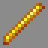

# Prometheus

***

#### 

# Overview
***
- **Introduced:** v1.8.0
- **Description:** A damage kit that uses the element of fire to deal damage.
- **Role:** Damage
- **How to Unlock:** Purchase for 500 Credits.

   

# Gear
***
- Chainmail Chestplate
- Chainmail Leggings
- Chainmail Boots
- Iron Sword
- Wand
- 7 Healing Potions

   

# Active Abilities
***
## Mana & Mana Regeneration
Mana is a resource that is used to cast spells. It will regenerate over time.

<!--  -->

After getting an elimination, the player will receive mana. The player will also receive a mana potion if they are the one who got the final blow.

<!--  -->

## Flame Spell
Summon fire in front of the player that will ignite all enemies in its range.

Flame spell burns cobwebs.

## Fireball  Spell
Summon a fireball that shoots in the direction the player is looking. This will deal damage to enemies and ignite them on fire. The Fireball spell damages engineer blocks, builder bricks, and jumper translocators.

The fireball can be deflected. 

## Imbue Spell
Gives the player fire aspect II and fire resistance for an extended duration.

If casted it again while the effects are active, then the player will incinerate.

  

# Achievements
***

| Achievement | Description | Reward |
| ----------- | ----------- | ------ |
| That was heated. | Use the imbue spell to save yourself from burning. | 20 Credits |
| That’s not fire. | Use the imbue spell again after already casting it. | 20 Credits |
| Frost fire | Use your flame thrower on an enemy player that has been affected by the ice effect. | 20 Credits |
| Deflected…but at what cost? | Deflect an enemy fireball and kill an ally. | 20 Credits |
| Grab the ember-ella! | Get a double fireball kill. | 50 Credits|
| Burn down the em-fire! | Get a triple fireball kill. | 50 Credits |
| I’ll have a blazed doughnut | Get 1,000 Fire Kills. | 250 Credits |
| In the Hall of Flame. | Get 1,000 fireball kills. | 250 Credits |
| It’s lit! | Ignite 10,000 enemies. | 250 Credits |

   

# Kit Data
***

| Property | Value | Description |
|----------|-------|-------------|
| | | |
| | | |
| | | |
| | | |
| | | |
