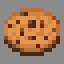

<!-- replace candyland with the actual map name -->
<!-- change gamemode type for the Map data description  -->
# Candyland

***

#### 

# Overview
***
- **Introduced:** v1.7.0
- **Description:** ___
- **Gamemode:**___
- **Map Type:**___
- **Size:**___
- **Contributors:**___

   

# Map Galley

# Achievements
***

| Achievement | Description | Reward |
| ----- | ----- | ------ |
| Sugar Rush! | Win a game on the map Candyland. | 20 Credits |

# Map Data
***

| Property | Value | Description |
| ----------- | ----------- | ------ |
| buildRadius |`{{ maps.candyland.data.buildRadius }}`| {{ mapPropertyDescriptions.buildRadius.classic }} |
| buildHeight |`{{ maps.candyland.data.buildHeight }}`| {{ mapPropertyDescriptions.buildHeight.classic }} |