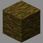

<!-- replace _map_ with the actual map name -->
<!-- change gamemode type for the Map data description  -->
# Lazarus

***

#### 

# Overview
***
- **Introduced:** v1.8.0
- **Description:** ___
- **Gamemode:** King of the Hill
- **Map Type:** Non-Build (NB)
- **Size:** Medium
- **Contributors:** alfredodan

   

# Map Galley

# Achievements
***

| Achievement | Description | Reward |
| ----- | ----- | ------ |
| The Fight for the Fountain of Youth | Win a game on the map Lazarus. | 20 Credits |

# Map Data
***

| Property | Value | Description |
| ----------- | ----------- | ------ |
| buildRadius |`{{ maps.lazarus.data.buildRadius }}`| {{ mapPropertyDescriptions.buildRadius.koth }} |
| buildHeight |`{{ maps.lazarus.data.buildHeight }}`| {{ mapPropertyDescriptions.buildHeight.koth }} |